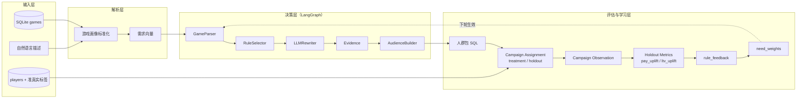

# GameBigR

[](https://www.python.org/downloads/)
[](https://pytest.org/)

**游戏圈群策略验证与人群包编排（Agent + 规则引擎 + 模拟评估）**

GameBigR is a small research/demo stack that turns **game product profiles** (from SQLite or **natural-language descriptions**) into **need vectors**, **tiered audience rules (P0/P1/P2/Exclusion)**, executable **SQL audience packages**, **simulated campaign metrics**, and **online learning** over business goals—wired together with **LangGraph**.

---

## 目录

- [功能特性](#功能特性)
- [架构概览](#架构概览)
- [环境要求](#环境要求)
- [安装](#安装)
- [快速开始](#快速开始)
- [配置说明](#配置说明)
- [项目结构](#项目结构)
- [测试](#测试)
- [许可证](#许可证)

---

## 功能特性

| 能力 | 说明 |
|------|------|
| **游戏画像输入** | 支持从 SQLite `games` 表读取结构化画像，或通过 **自然语言描述** 做意图识别与字段抽取后入库 |
| **需求向量** | 基于本体规则将画像标签映射为「需求」权重（`parse_game_to_needs`） |
| **Agent 编排** | LangGraph 流水线：解析 → 规则与 SQL → LLM 规则重写（可选）→ 证据摘要 → 人群包 |
| **规则与 SQL** | 由策略引擎生成多档人群包 SQL（强匹配 / 高潜扩量 / 低成本探索 / 不推荐） |
| **模拟评估** | 对 `players` 表执行人群 SQL，汇总安装、D7、首充、LTV 等模拟指标 |
| **在线学习** | 根据业务目标与反馈更新 need 权重（演示用模拟反馈） |
| **对照实验** | 导出多组实验 SQL 与汇总结果（如 `outputs/` 下 CSV） |

---

## 架构概览



### 架构分层说明（含在线学习闭环）

1. **输入层（Game + Player）**
   - 游戏侧输入支持两种来源：`games` 表结构化字段，或自然语言描述抽取后再写入 `games`。
   - 玩家侧 `players` 同时提供行为特征与准真实标签（如 `quasi_real_first_pay_label`、`quasi_real_ltv30`），用于 holdout 评估与反馈学习。

2. **解析层（画像与需求）**
   - 对游戏画像进行标准化后映射为需求向量（need distribution），作为后续规则选择的决策上下文。
   - 若有业务目标（如 `high_ltv`），会对需求向量做目标导向调整与权重缩放。

3. **决策层（LangGraph 编排）**
   - `GameParser`：读取画像并生成需求向量。
   - `RuleSelector`：基于本体规则生成 P0/P1/P2/EXCLUSION 条件。
   - `LLMRewriter`（可选）：在白名单约束下对规则做增量重写。
   - `Evidence`：输出 direct/proxy 证据比例与风险标记。
   - `AudienceBuilder`：产出可执行人群包 SQL（`strong_match` / `high_potential_expand` / `low_cost_explore` / `not_recommended`）。

4. **评估与学习层（核心闭环）**
   - **Campaign Assignment**：从目标包（示例为 `high_potential_expand`）中随机切分 treatment 与 holdout（默认 20%）。
   - **Campaign Observation**：写入活动观测，记录每位用户的支付与 LTV 标签。
   - **Holdout Metrics**：计算 `treatment - holdout` 的增量（`pay_uplift`、`ltv_uplift`），避免“只看触达人群”导致的高估。
   - **Feedback 回写**：将 uplift 映射为 `rule_feedback.reward_score`，并按 need 强度分配信用。
   - **权重更新**：`need_weights` 依据历史反馈做平滑更新（有上下界保护），在下一轮编排时生效，形成可解释的在线学习回路。

5. **为什么这套闭环有效**
   - 把“策略是否真的带来增量”与“触达人群天生表现更好”分离开。
   - 学习信号来源于 holdout 对照，而不是单看圈中用户绝对指标。
   - 保持规则可解释性的同时，持续让权重向高增量方向收敛。

---

## 环境要求

- **Python** 3.10+（推荐与本地 `venv` 一致）
- **可选**：兼容 OpenAI API 的密钥与 Base URL，用于 LLM 规则重写与自然语言画像抽取

---

## 安装

```bash
git clone <your-repo-url> GameBigR
cd GameBigR
python -m venv .venv

# Windows
.venv\Scripts\activate

# macOS / Linux
source .venv/bin/activate

pip install -r requirements.txt
```

> 依赖包含：`langgraph`、`langchain-core`、`langchain-openai`、`pytest` 等，详见 [`requirements.txt`](requirements.txt)。

---

## 快速开始

### 1. 使用内置示例画像（数据库种子）

在项目根目录执行：

```bash
python run_e2e.py
```

将初始化 `circle_strategy.db`、写入示例游戏与模拟玩家、跑通 Agent、评估、在线学习与实验导出。

### 2. 使用自然语言描述游戏

由模块 **`extract_game_profile_from_description`** 解析描述并写入 `games` 表，再执行同一套编排：

```bash
python run_e2e.py --from-description "三国赛季制SLG，强公会国战，写实画风，赛季更新，口碑4.5分"
```

### 3. 在代码中调用

```python
from src.db import connect, init_schema
from src.data_builder import insert_game, populate_players
from src.agentic_workflow import run_agentic_orchestrator_from_description

conn = connect("circle_strategy.db")
init_schema(conn)
# 需先保证 players 等数据与业务场景一致后再评估
result = run_agentic_orchestrator_from_description(
    conn,
    "休闲奇幻题材，弱竞技，持续更新",
    business_goal="high_ltv",
    upsert_db=True,
)
print(result["extraction"], result["needs"])
```

---

## 配置说明

在项目根目录创建 `.env`（可选，用于 LLM 能力）：

| 变量 | 说明 |
|------|------|
| `OPENAI_API_KEY` | API 密钥；未设置时，规则重写与自然语言抽取会回退到启发式逻辑 |
| `OPENAI_BASE_URL` | 自定义兼容端点（如 DeepSeek、自建网关），需以 `/v1` 为路径约定 |
| `RULE_LLM_MODEL` | 覆盖默认模型名（见 `src/llm_rules.py` 中 `build_LLM_args`） |

---

## 项目结构

```
GameBigR/
├── run_e2e.py              # 端到端演示入口（CLI）
├── requirements.txt
├── src/
│   ├── agentic_workflow.py # LangGraph 编排与对外入口
│   ├── game_description_parser.py  # 自然语言 → 游戏画像
│   ├── strategy_engine.py  # 需求解析、规则与 SQL 组装
│   ├── ontology.py         # 本体：需求与规则模板
│   ├── llm_rules.py        # LLM 规则重写（可选）
│   ├── db.py               # SQLite schema
│   ├── data_builder.py     # 种子数据写入
│   ├── evaluation.py       # 人群 SQL 模拟指标
│   ├── online_learning.py  # need 权重更新
│   └── experiments.py      # 对照实验与导出
├── tests/                  # pytest
└── outputs/                # 实验导出（运行后生成）
```

---

## 测试

```bash
pytest -v
```

---

## 许可证

本项目未默认指定开源许可证；若对外发布，请自行补充 `LICENSE` 文件并更新本节说明。

---

## 致谢

设计与实现参考了常见开源 README 的写法：清晰的徽章、功能表、架构图、安装与配置分段，便于新贡献者快速上手。
